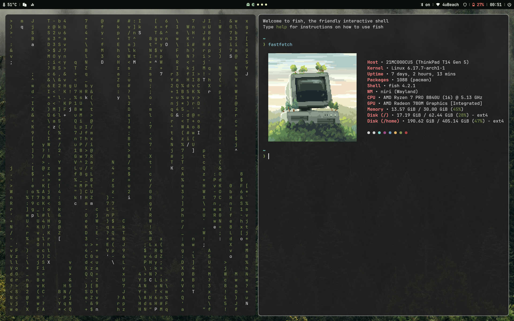
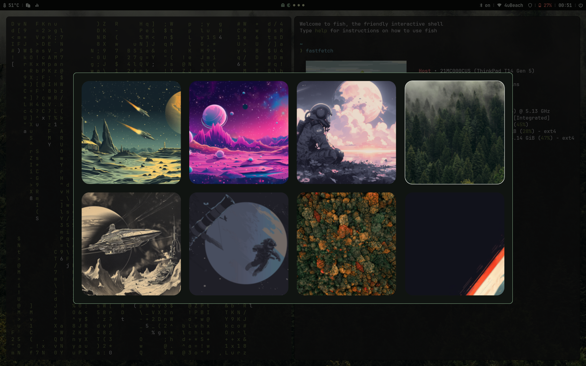
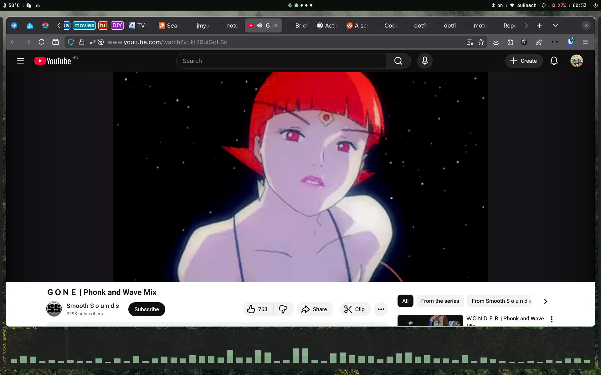

# Dotfiles

Copy what you want

## Showcase







## AmneziaVPN

Install:

```sh
yay -S amneziawg-go openresolv amneziawg-tools
```

Up VPN:

```sh
sudo awg-quick up amnezia_for_awg.conf
```

Down VPN:

```sh
sudo awg-quick down amnezia_for_awg.conf
```

## Caching DNS

As described at [Systemd-resolved wiki](https://wiki.archlinux.org/title/Systemd-resolved):

```sh
sudo systemctl enable systemd-resolved.service
sudo systemctl start systemd-resolved.service
sudo ln -sf ../run/systemd/resolve/stub-resolv.conf /etc/resolv.conf

```

## Other

```sh
sudo systemctl enable linux-modules-cleanup.service
```

## Heroes 3 HotA

Install packages:

```sh
yay -S umu-launcher lib32-pipewire lib32-gnutls
```

Install the game:
```sh
GAMEID="Heroes3_HotA" umu-run <path to installer>
```

Run the game:
```sh
GAMEID="Heroes3_HotA" UMU_RUNTIME_UPDATE=0 umu-run HD_Launcher.exe
```

(optional) Create desktop entry at `$HOME/.local/share/applications`:
```sh
cat > $HOME/.local/share/applications/Heroes3HotA.desktop <<EOF
[Desktop Entry]
Type=Application
Name=Heroes 3
Path=$HOME/Games/umu/Heroes3_HotA/drive_c/Games/Heroes3_HotA
Exec=env GAMEID="Heroes3_HotA" UMU_RUNTIME_UPDATE=0 umu-run $HOME/Games/umu/Heroes3_HotA/drive_c/Games/Heroes3_HotA/HD_Launcher.exe
StartupNotify=true
Icon=$HOME/Games/umu/Heroes3_HotA/drive_c/Games/Heroes3_HotA/icon.png
Categories=Game
EOF

```
Also you need an icon for menu entry

# Vim

Just copy everything into your home. For complete vim installation run inside vim `:PlugInstall`

# Switch colorschemes

```sh
matugen image $(swww query | sed 's/^.*image:\ //')
# or
walng --theme https://github.com/tinted-theming/schemes/raw/refs/heads/spec-0.11/base16/hardcore.yaml
```

# Theming

- [matugen](https://github.com/InioX/matugen)
- [wallust](https://codeberg.org/explosion-mental/wallust)
- [cwal](https://github.com/nitinbhat972/cwal)
- [rong](https://github.com/Nadim147c/rong)
- [gowall](https://github.com/Achno/gowall)
- [tinty](https://github.com/tinted-theming/tinty)
