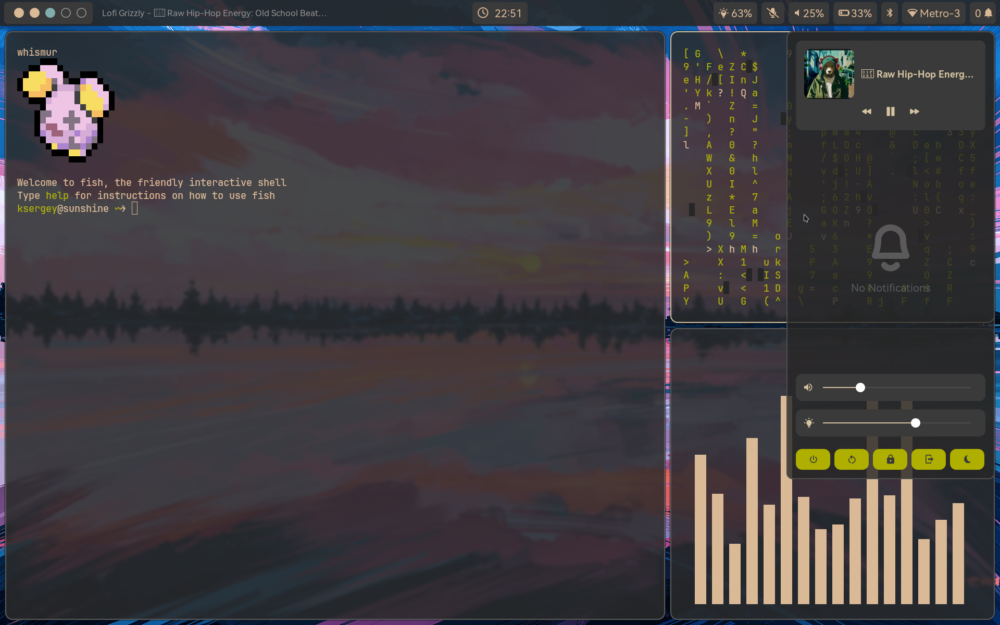
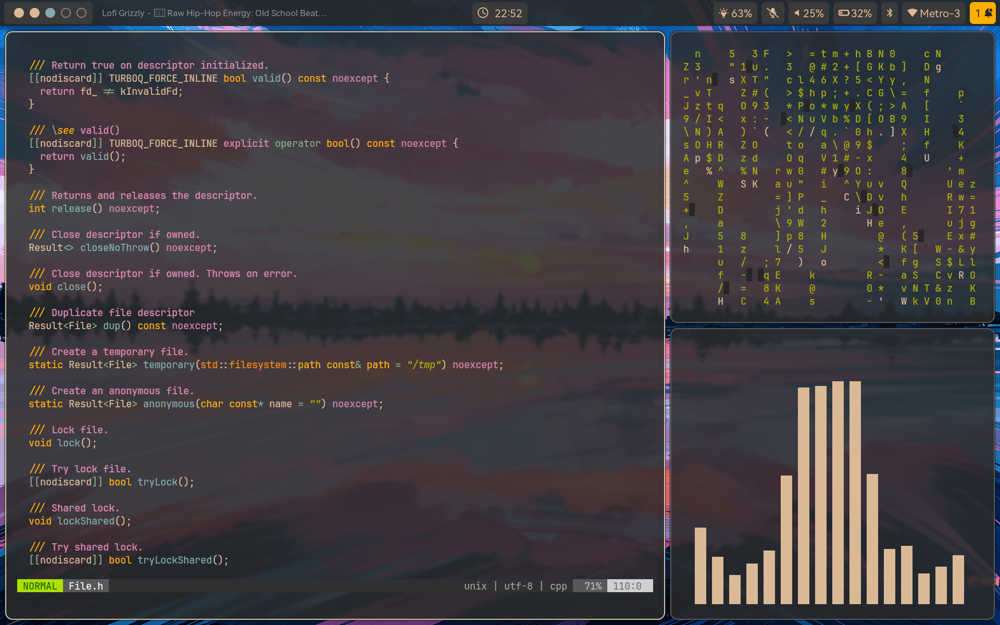
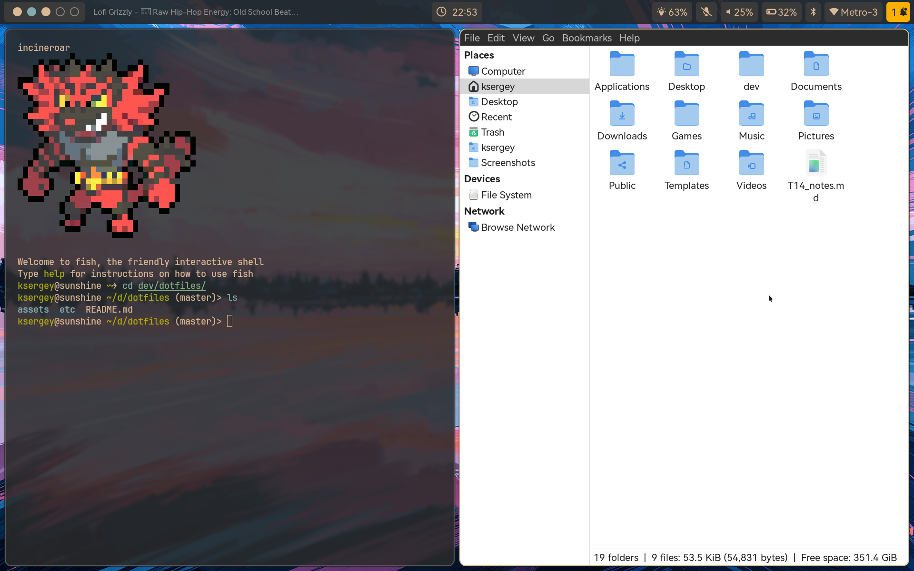
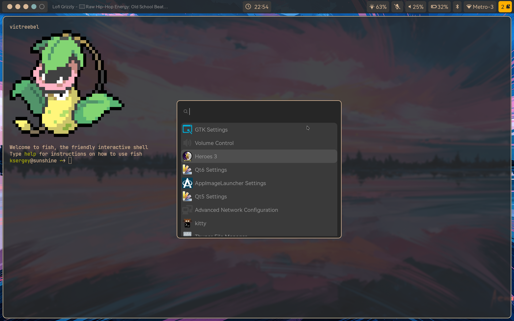

# Dotfiles

# Packages

```sh
yay -S hyprland hyprlock hypridle wl-clipboard swaync waybar swww wofi kitty fish \
    wev swayimg mpv yt-dlp cmus thunar thunar-volman gvfs htop pipewire pipewire-pulse \
    ttf-harmonyos-sans ttf-jetbrains-mono ttf-jetbrains-mono-nerd network-manager blueman \
    nvtop termshark
```

## AmneziaVPN

Install:

```sh
yay -S amneziawg-go openresolv amneziawg-tools
```

Up VPN:

```sh
sudo awg-quick up amnezia_for_awg.conf
```

Down VPN:

```sh
sudo awg-quick down amnezia_for_awg.conf
```


# Vim

Just copy everything into your home. For complete vim installation run inside vim `:PlugInstall`

# Screenshots

<p align="center">
  
  
  
  
</p>
